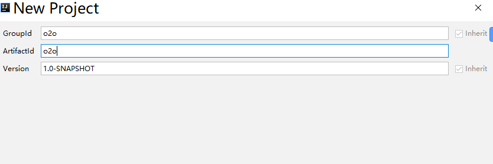
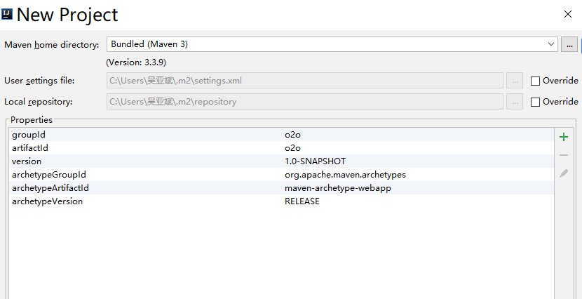
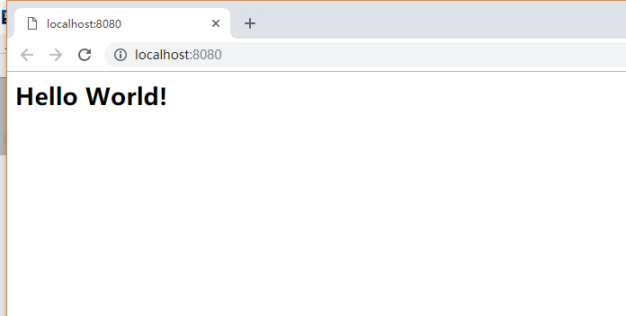
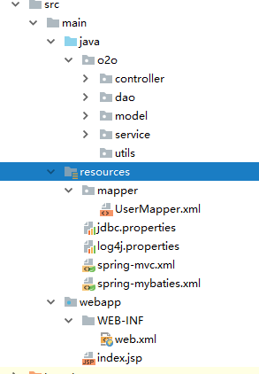
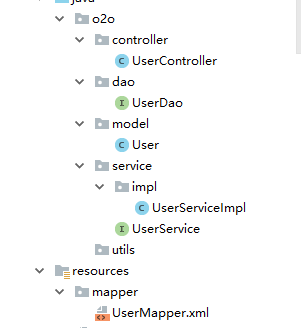
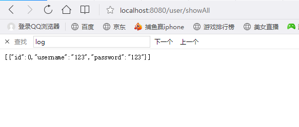

# IDEA构建Maven＋SSM


### 创建IDEA项目

1. 点击New project


<!--more-->

2. 找到Maven，勾选钩选`Create from` archetype选择模板，选择webapp模板，完成后点击next继续。


1. 填写你自己的GroupId和ArtifactId就项目命。



1. 选择Maven的地址



5. 填写项目命finish就可以
6. 运行测试下web项目。

点击 `Edit Configurations`


点击添加，找到 `tomcat local`


点击 `deployment` 的添加把刚刚建的项目导进来


点击ok就可以了

右上角会多出来一个

直接run运行


### SSM项目配置

1. 更改`pom.xml`文件

``` 

<?xml version="1.0" encoding="UTF-8"?>

<project xmlns="http://maven.apache.org/POM/4.0.0" xmlns:xsi="http://www.w3.org/2001/XMLSchema-instance"
  xsi:schemaLocation="http://maven.apache.org/POM/4.0.0 http://maven.apache.org/xsd/maven-4.0.0.xsd">
  <modelVersion>4.0.0</modelVersion>

  <groupId>o2o</groupId>
  <artifactId>o2o</artifactId>
  <version>1.0-SNAPSHOT</version>
  <packaging>war</packaging>

  <name>o2o Maven Webapp</name>
  <!-- FIXME change it to the project's website -->
  <url>http://www.example.com</url>

  <properties>
    <project.build.sourceEncoding>UTF-8</project.build.sourceEncoding>
    <maven.compiler.source>1.7</maven.compiler.source>
    <maven.compiler.target>1.7</maven.compiler.target>

    <!-- 设置项目编码编码 -->
    <project.build.sourceEncoding>UTF-8</project.build.sourceEncoding>
    <project.reporting.outputEncoding>UTF-8</project.reporting.outputEncoding>
    <!-- spring版本号 -->
    <spring.version>4.3.5.RELEASE</spring.version>
    <!-- mybatis版本号 -->
    <mybatis.version>3.4.1</mybatis.version>
    <!-- log4j日志包版本号 -->
    <slf4j.version>1.7.18</slf4j.version>
    <log4j.version>1.2.17</log4j.version>
  </properties>

  <dependencies>
    <!-- java ee -->
    <dependency>
      <groupId>javax</groupId>
      <artifactId>javaee-api</artifactId>
      <version>7.0</version>
    </dependency>

    <!-- Spring -->
    <dependency>
      <groupId>org.springframework</groupId>
      <artifactId>spring-core</artifactId>
      <version>${spring.version}</version>
    </dependency>
    <dependency>
      <groupId>org.springframework</groupId>
      <artifactId>spring-beans</artifactId>
      <version>${spring.version}</version>
    </dependency>
    <dependency>
      <groupId>org.springframework</groupId>
      <artifactId>spring-context</artifactId>
      <version>${spring.version}</version>
    </dependency>
    <dependency>
      <groupId>org.springframework</groupId>
      <artifactId>spring-jdbc</artifactId>
      <version>${spring.version}</version>
    </dependency>
    <dependency>
      <groupId>org.springframework</groupId>
      <artifactId>spring-tx</artifactId>
      <version>${spring.version}</version>
    </dependency>
    <dependency>
      <groupId>org.springframework</groupId>
      <artifactId>spring-web</artifactId>
      <version>${spring.version}</version>
    </dependency>
    <dependency>
      <groupId>org.springframework</groupId>
      <artifactId>spring-webmvc</artifactId>
      <version>${spring.version}</version>
    </dependency>
    <dependency>
      <groupId>org.springframework</groupId>
      <artifactId>spring-test</artifactId>
      <version>${spring.version}</version>
    </dependency>

    <!-- 添加jstl依赖 -->
    <dependency>
      <groupId>jstl</groupId>
      <artifactId>jstl</artifactId>
      <version>1.2</version>
    </dependency>
    <!-- 添加日志相关jar包 -->
    <dependency>
      <groupId>log4j</groupId>
      <artifactId>log4j</artifactId>
      <version>${log4j.version}</version>
    </dependency>
    <dependency>
      <groupId>org.slf4j</groupId>
      <artifactId>slf4j-api</artifactId>
      <version>${slf4j.version}</version>
    </dependency>
    <dependency>
      <groupId>org.slf4j</groupId>
      <artifactId>slf4j-log4j12</artifactId>
      <version>${slf4j.version}</version>
    </dependency>
    <!-- MyBatis -->
    <dependency>
      <groupId>org.mybatis</groupId>
      <artifactId>mybatis</artifactId>
      <version>${mybatis.version}</version>
    </dependency>

    <!-- mybatis/spring整合包 -->
    <dependency>
      <groupId>org.mybatis</groupId>
      <artifactId>mybatis-spring</artifactId>
      <version>1.3.1</version>
    </dependency>

    <!-- 数据库 -->
    <dependency>
      <groupId>mysql</groupId>
      <artifactId>mysql-connector-java</artifactId>
      <version>5.1.41</version>
      <scope>runtime</scope>
    </dependency>

    <!-- 数据库连接池 -->
    <dependency>
      <groupId>com.mchange</groupId>
      <artifactId>c3p0</artifactId>
      <version>0.9.5.2</version>
    </dependency>

    <!-- JSON -->
    <dependency>
      <groupId>com.fasterxml.jackson.core</groupId>
      <artifactId>jackson-databind</artifactId>
      <version>2.8.7</version>
    </dependency>
  </dependencies>

  <build>
    <finalName>o2o</finalName>
    <pluginManagement><!-- lock down plugins versions to avoid using Maven defaults (may be moved to parent pom) -->
      <plugins>
        <plugin>
          <artifactId>maven-clean-plugin</artifactId>
          <version>3.1.0</version>
        </plugin>
        <!-- see http://maven.apache.org/ref/current/maven-core/default-bindings.html#Plugin_bindings_for_war_packaging -->
        <plugin>
          <artifactId>maven-resources-plugin</artifactId>
          <version>3.0.2</version>
        </plugin>
        <plugin>
          <artifactId>maven-compiler-plugin</artifactId>
          <version>3.8.0</version>
        </plugin>
        <plugin>
          <artifactId>maven-surefire-plugin</artifactId>
          <version>2.22.1</version>
        </plugin>
        <plugin>
          <artifactId>maven-war-plugin</artifactId>
          <version>3.2.2</version>
        </plugin>
        <plugin>
          <artifactId>maven-install-plugin</artifactId>
          <version>2.5.2</version>
        </plugin>
        <plugin>
          <artifactId>maven-deploy-plugin</artifactId>
          <version>2.8.2</version>
        </plugin>
      </plugins>
    </pluginManagement>
  </build>
</project>

```

2 . 构建项目基本目录



* java文件的创建后，右击`Make Directory as`>>`Source root`
* resources文件创建后, 右击`Make Directory as`>>`Resources Root`
* properties文件创建, 右击`new`>>`Resource Bundle`


填写名字后直接点击ok

* spring-mvc.xml和spring-mybaties.xml创建右击`new`>>`XML Configuration File`>>`Spring config`

3 . `jdbc.propreties` 文件(存放数据库的配置文件)

``` 

jdbc.driver=com.mysql.jdbc.Driver
#数据库地址
jdbc.url=jdbc:mysql://localhost:3306/test?useUnicode=true&characterEncoding=utf8
#用户名
jdbc.username=用户名
#密码
jdbc.password=密码
#最大连接数
c3p0.maxPoolSize=30
#最小连接数
c3p0.minPoolSize=10
#关闭连接后不自动commit
c3p0.autoCommitOnClose=false
#获取连接超时时间
c3p0.checkoutTimeout=10000
#当获取连接失败重试次数
c3p0.acquireRetryAttempts=2
```

4 . log4j.propreties(日志文件的配置)

``` 

### set log levels ###

log4j.rootLogger = info , Console , D  
#Console
log4j.appender.Console=org.apache.log4j.ConsoleAppender  
log4j.appender.Console.layout=org.apache.log4j.PatternLayout  
log4j.appender.Console.layout.ConversionPattern=%d [%t] %-5p [%c] - %m%n  
log4j.logger.java.sql.ResultSet=INFO  
log4j.logger.org.apache=INFO  
log4j.logger.java.sql.Connection=INFO  
log4j.logger.java.sql.Statement=INFO  
log4j.logger.java.sql.PreparedStatement=INFO  
#output2file
log4j.appender.D = org.apache.log4j.DailyRollingFileAppender   
log4j.appender.D.File = D\:/logs/log.log   
log4j.appender.D.Append = true   
log4j.appender.D.Threshold = INFO \#\# \u00E8\u00BE\u0093\u00E5\u0087\u00BAinfo\u00E7\u00BA\u00A7\u00E5\u0088\u00AB\u00E4\u00BB\u00A5\u00E4\u00B8\u008A\u00E7\u009A\u0084\u00E6\u0097\u00A5\u00E5\u00BF\u0097   
log4j.appender.D.layout = org.apache.log4j.PatternLayout   
log4j.appender.D.layout.ConversionPattern = %-d{yyyy-MM-dd HH\:mm\:ss} [ %t\:%r ] - [ %p ] %m%n  
```

5 . `spring-mvc.xml`

``` 

<?xml version="1.0" encoding="UTF-8"?>
<beans xmlns="http://www.springframework.org/schema/beans"
       xmlns:xsi="http://www.w3.org/2001/XMLSchema-instance"
       xmlns:context="http://www.springframework.org/schema/context"
       xmlns:mvc="http://www.springframework.org/schema/mvc"
       xsi:schemaLocation="http://www.springframework.org/schema/beans
       http://www.springframework.org/schema/beans/spring-beans.xsd
       http://www.springframework.org/schema/context
       http://www.springframework.org/schema/context/spring-context.xsd
       http://www.springframework.org/schema/mvc
       http://www.springframework.org/schema/mvc/spring-mvc-3.2.xsd">

    <!-- 自动扫描的包名,只扫描@Controller -->
    <context:component-scan base-package="o2o.controller" >
        <context:include-filter type="annotation" expression="org.springframework.stereotype.Controller"/>
    </context:component-scan>

    <!-- 开启SpringMVC注解模式 -->
    <mvc:annotation-driven/>

    <!-- 静态资源默认servlet配置 -->
    <mvc:default-servlet-handler/>

    <!-- 配置jsp 显示ViewResolver -->
    <bean class="org.springframework.web.servlet.view.InternalResourceViewResolver">
        <property name="prefix" value="/WEB-INF/views/"/>
        <property name="suffix" value=""/>
    </bean>

</beans>
```

6 . `spring-mybaties.xml` (mybaties文件配置)

``` 

<?xml version="1.0" encoding="UTF-8"?>
<beans xmlns="http://www.springframework.org/schema/beans"
       xmlns:xsi="http://www.w3.org/2001/XMLSchema-instance"
       xmlns:context="http://www.springframework.org/schema/context"
       xmlns:tx="http://www.springframework.org/schema/tx"
       xsi:schemaLocation="http://www.springframework.org/schema/beans
       http://www.springframework.org/schema/beans/spring-beans.xsd
       http://www.springframework.org/schema/context
       http://www.springframework.org/schema/context/spring-context.xsd
       http://www.springframework.org/schema/tx
       http://www.springframework.org/schema/tx/spring-tx.xsd">

    <!-- 扫描service和dao包下所有使用注解的类型 -->
    <context:component-scan base-package="o2o.service">
        <context:exclude-filter type="annotation" expression="org.springframework.stereotype.Controller"/>
    </context:component-scan>

    <!-- 配置数据库相关参数properties的属性：${url} -->
    <context:property-placeholder location="classpath:jdbc.properties"/>

    <!-- 数据库连接池 -->
    <bean id="dataSource" class="com.mchange.v2.c3p0.ComboPooledDataSource">
        <property name="driverClass" value="${jdbc.driver}"/>
        <property name="jdbcUrl" value="${jdbc.url}"/>
        <property name="user" value="${jdbc.username}"/>
        <property name="password" value="${jdbc.password}"/>
        <property name="maxPoolSize" value="${c3p0.maxPoolSize}"/>
        <property name="minPoolSize" value="${c3p0.minPoolSize}"/>
        <property name="autoCommitOnClose" value="${c3p0.autoCommitOnClose}"/>
        <property name="checkoutTimeout" value="${c3p0.checkoutTimeout}"/>
        <property name="acquireRetryAttempts" value="${c3p0.acquireRetryAttempts}"/>
    </bean>

    <!-- 配置SqlSessionFactory对象 -->
    <bean id="sqlSessionFactory" class="org.mybatis.spring.SqlSessionFactoryBean">
        <!-- 注入数据库连接池 -->
        <property name="dataSource" ref="dataSource"/>
        <!-- 扫描model包 使用别名 -->
        <property name="typeAliasesPackage" value="com.test.model"/>
        <!-- 扫描sql配置文件:mapper需要的xml文件 -->
        <property name="mapperLocations" value="classpath:mapper/*.xml"/>
    </bean>

    <!-- 配置扫描Dao接口包，动态实现Dao接口，注入到spring容器中 -->
    <bean class="org.mybatis.spring.mapper.MapperScannerConfigurer">
        <!-- 注入sqlSessionFactory -->
        <property name="sqlSessionFactoryBeanName" value="sqlSessionFactory"/>
        <!-- 给出需要扫描Dao接口包 -->
        <property name="basePackage" value="o2o.dao"/>
    </bean>

</beans>
```

7 . `web.xml` 配置

``` 

<?xml version="1.0" encoding="UTF-8"?>
<web-app xmlns="http://xmlns.jcp.org/xml/ns/javaee"
         xmlns:xsi="http://www.w3.org/2001/XMLSchema-instance"
         xsi:schemaLocation="http://xmlns.jcp.org/xml/ns/javaee http://xmlns.jcp.org/xml/ns/javaee/web-app_3_1.xsd"
         version="3.1">
<display-name>Archetype Created Web Application</display-name>
    <context-param>
        <param-name>contextConfigLocation</param-name>
        <param-value>classpath:spring-mybaties.xml</param-value>
    </context-param>
    <!-- 编码过滤器 -->
    <filter>
        <filter-name>encodingFilter</filter-name>
        <filter-class>org.springframework.web.filter.CharacterEncodingFilter</filter-class>
        <init-param>
            <param-name>encoding</param-name>
            <param-value>UTF-8</param-value>
        </init-param>
    </filter>
    <filter-mapping>
        <filter-name>encodingFilter</filter-name>
        <url-pattern>/*</url-pattern>
    </filter-mapping>

    <!-- 配置DispatcherServlet -->
    <servlet>
        <servlet-name>SpringMVC</servlet-name>
        <servlet-class>org.springframework.web.servlet.DispatcherServlet</servlet-class>
        <!-- 配置springMVC需要加载的配置文件-->
        <init-param>
            <param-name>contextConfigLocation</param-name>
            <param-value>classpath*:spring-*.xml</param-value>
        </init-param>
        <load-on-startup>1</load-on-startup>
        <async-supported>true</async-supported>
    </servlet>
    <servlet-mapping>
        <servlet-name>SpringMVC</servlet-name>
        <!-- 匹配所有请求，此处也可以配置成 *.do 形式 -->
        <url-pattern>/</url-pattern>
    </servlet-mapping>
</web-app>

```

至此配置文件的部分就完成了

### 测试代码

1.  代码目录



2.  实体类创建(User)

``` 

@Component
public class User {
    private int id;
    private String username;
    private String password;

    public int getId() {
        return id;
    }

    public void setId(int id) {
        this.id = id;
    }

    public String getUsername() {
        return username;
    }

    public void setUsername(String username) {
        this.username = username;
    }

    public String getPassword() {
        return password;
    }

    public void setPassword(String password) {
        this.password = password;
    }
}

```

3 . UserDao创建(数据库层)

``` 

public interface UserDao {
    List<User> selectAllUser();
    void save(User user);
    boolean update(User user);
    boolean delete(int id);
    User findById(int id);
}

```

4 . UserService层创建

``` 

public interface UserService {
    public List<User> findAll();
}
```

5 . UserServiceImpl

``` 

@Service("/userService")
public class UserServiceImpl implements UserService {

    @Resource
    private UserDao userDao;
    @Override
    public List<User> findAll() {
        return userDao.selectAllUser();
    }
}

```

6 . UserController

``` 

@Controller
@RequestMapping("/user")
public class UserController {
    @Resource
    UserService service;

    @RequestMapping("/showAll")
    @ResponseBody
    public List<User> showAll(){
        System.out.println(service.findAll());
        return service.findAll();
    }

}
```

7. sql文件 

``` 

create table user
(
  id       int          not null
    primary key,
  username varchar(255) null,
  password varchar(255) null
);

```

8. 直接run运行



### [Github项目地址](https://github.com/wubmu/SSM/)

